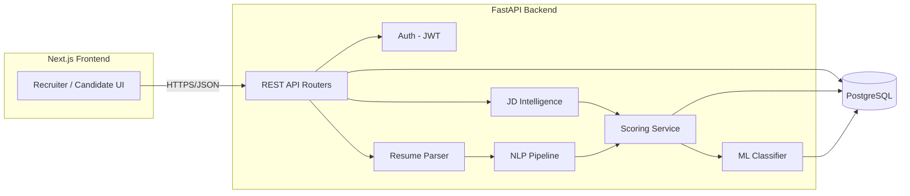
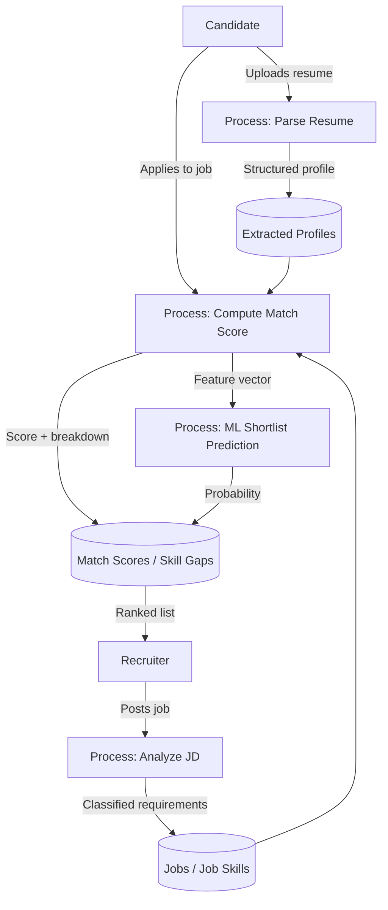
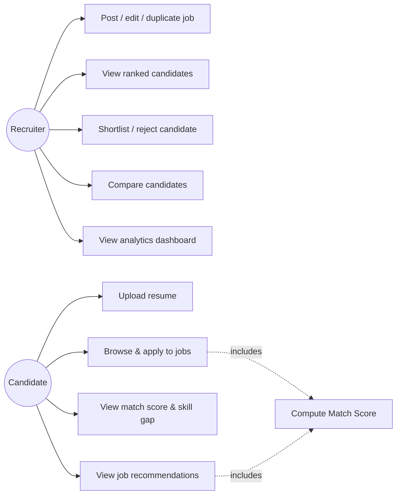
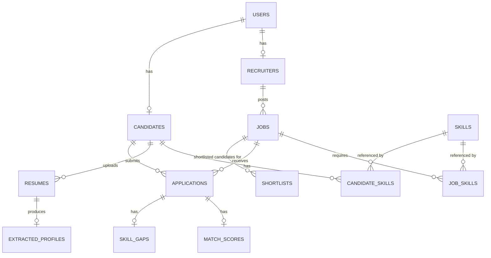
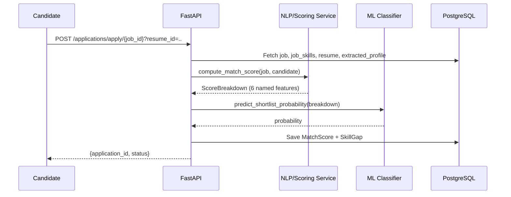

# Final-Year Project Documentation
## Talentum — AI-Powered Recruitment & Talent Intelligence Platform

> Diagrams below are given as Mermaid source. Paste any block into
> https://mermaid.live (or a Mermaid-enabled Markdown viewer / VS Code
> extension) to render it as an image for your report or slides.

---

## 1. Abstract

Manual resume screening does not scale, and keyword-based Applicant
Tracking Systems (ATS) miss semantically equivalent skills (e.g. "Django
REST Framework" vs. "REST API development"), producing false negatives that
filter out qualified candidates before a human ever sees them. This project
presents Talentum, a recruitment intelligence platform that combines
rule-based NLP, embedding-based semantic similarity, and a supervised
machine-learning classifier to score and rank candidates against job
descriptions transparently. Every match score decomposes into named,
auditable components (skill match, semantic similarity, experience fit,
project relevance, education, certifications), and a separately trained
classifier (Random Forest, F1 = 0.9098, ROC-AUC = 0.987 on held-out data)
estimates shortlist probability without replacing that transparency. The
system is implemented as a full-stack web application (FastAPI + PostgreSQL
backend, Next.js frontend) with JWT authentication, role-separated recruiter
and candidate experiences, and Docker-based deployment.

## 2. Introduction

Recruitment is a high-stakes, high-volume decision process: a single job
posting can attract hundreds of applicants, and the cost of a bad screening
decision compounds across the hiring funnel. This project explores how NLP
and ML can assist — not replace — human recruiters, by automating the
mechanical parts of screening (extraction, comparison, ranking) while
keeping the reasoning behind every score visible and auditable.

## 3. Problem statement

Given a job description and a pool of candidate resumes, automatically:
1. Extract structured requirements from the job description and classify
   them by priority (must-have vs. good-to-have).
2. Extract a structured candidate profile from each resume (skills,
   experience, education, projects, certifications).
3. Produce a ranked list of candidates with a transparent, explainable
   match score — not a single opaque number.
4. Do all of the above without amplifying bias based on protected or
   irrelevant attributes (see Responsible AI, §16).

## 4. Objectives

- Build an NLP pipeline that extracts and normalizes skills from free text
  with better recall than exact keyword search.
- Implement a multi-factor scoring model whose output is decomposable into
  named, weighted features.
- Train and evaluate a genuine supervised ML model (not just the rule-based
  score) using standard classification metrics.
- Build a production-shaped full-stack application (auth, database, REST
  API, responsive frontend) around this core engine.
- Document dataset provenance and limitations honestly rather than
  presenting placeholder results as real-world validated ones.

## 5. Existing system

Traditional ATS platforms typically rely on exact keyword matching between
a resume and a job description, optionally with basic boolean search
(AND/OR/NOT of terms). This produces two failure modes: (a) false
negatives, when a candidate uses different terminology for an equivalent
skill, and (b) opacity, when a "match score" is shown with no breakdown of
what drove it, making it hard for a recruiter to trust or challenge the
system's output.

## 6. Proposed system

Talentum addresses both failure modes:
- **Semantic matching** (embedding cosine similarity) catches
  terminology variation that exact keyword search misses.
- **Explainable scoring**: every score is a transparent weighted sum of six
  named features, plus a separately-labeled ML probability — never a single
  unexplained number.
- **Skill-gap analysis** gives actionable feedback (what's missing, and
  whether it's critical or secondary), useful to both recruiters and
  candidates.

## 7. Literature review (pointers)

Relevant areas to cite in a formal report:
- **TF-IDF & Latent Semantic Analysis**: Salton & McGill's vector space
  model; Deerwester et al. (1990) on LSA — the basis of this project's
  default semantic backend.
- **Sentence embeddings**: Reimers & Gurevych (2019), "Sentence-BERT:
  Sentence Embeddings using Siamese BERT-Networks" — the basis of the
  optional `sbert` backend.
- **Named Entity Recognition**: spaCy's statistical NER pipeline
  (Honnibal & Montani).
- **Gradient boosting**: Chen & Guestrin (2016), "XGBoost: A Scalable Tree
  Boosting System".
- **Explainable AI in hiring**: NIST AI Risk Management Framework; EU AI
  Act's treatment of employment-related AI as "high-risk", motivating the
  transparency-first design here.
- **Resume parsing / information extraction**: prior work on
  section-segmentation heuristics for semi-structured documents (resumes
  lack a fixed schema, unlike most NLP benchmarks).

## 8. Methodology

Overall pipeline (see §10 for the architecture diagram and §13 for the
sequence diagram):
1. Job description → JD Intelligence (rule-based skill classification +
   regex-based experience/education extraction).
2. Resume → text extraction (pdfplumber/python-docx) → NLP pipeline
   (cleaning, section detection, spaCy NER, skill-taxonomy matching).
3. Job requirements × candidate profile → six-factor transparent score.
4. Same six factors → trained classifier → shortlist probability.
5. Recruiter reviews ranked list, shortlists/rejects; candidate sees
   recommendations from the same engine run in the opposite direction.

## 9. Architecture

## 10. Data Flow Diagram (Level 1)

## 11. Use Case Diagram

## 12. ER Diagram

## 13. Sequence Diagram — Apply to a job

## 14. ML methodology (summary — full detail in root README §6)

Two clearly separated components: (1) a transparent weighted-feature score
computed with plain arithmetic, and (2) a Random Forest classifier trained
on the same six features to predict `P(shortlisted)`. Logistic Regression
and XGBoost were also trained and compared; Random Forest was selected by
highest F1 on a held-out stratified split. See root README for the full
metrics table, dataset generation methodology, and honest discussion of why
synthetic (not scraped real-world) data was used in this build environment.

## 15. NLP methodology (summary — full detail in root README §7)

Text cleaning and section detection via regex/heuristics; entity extraction
via spaCy `en_core_web_sm`; skill extraction via a curated, alias-normalized
taxonomy matched longest-alias-first; semantic similarity via a pluggable
TF-IDF+LSA / sentence-transformers interface.

## 16. AI methodology / Generative AI scope

Generative AI is intentionally scoped to explanation/summarization tasks
layered on top of the deterministic scoring pipeline, never used for the
core numeric decision (see root README §6–7 for the reasoning). The schema
reserves a distinct `llm_explanation` field, separate from
`model_score_breakdown`, so generated narrative text can never be mistaken
for — or silently substituted for — the auditable score.

## 17. Database design

See root README §8 and `backend/app/models/models.py` for the full
SQLAlchemy schema and the ER diagram above.

## 18. Results

From the last training run (`ml/evaluation/metrics.json`):

| Model | Precision | Recall | F1 | ROC-AUC |
|---|---|---|---|---|
| Logistic Regression | 0.9101 | 0.9033 | 0.9067 | 0.9886 |
| Random Forest (selected) | 0.9015 | 0.9182 | 0.9098 | 0.9870 |
| XGBoost | 0.8993 | 0.8959 | 0.8976 | 0.9840 |

Functional results: 23/23 backend pytest tests passing, covering the full
apply → score → rank → shortlist workflow; a clean, TypeScript-checked
Next.js production build across 17 routed pages.

## 19. Evaluation

Standard classification metrics (precision, recall, F1, ROC-AUC, confusion
matrix) were used because shortlisting is fundamentally a binary
classification problem per candidate-job pair. Precision matters more than
recall in this application (a false positive wastes recruiter time
reviewing a poor-fit candidate; a false negative risks missing a good
candidate but is partially mitigated by the transparent score still being
visible for borderline cases) — this tradeoff is worth discussing explicitly
in a viva.

## 20. Limitations

See root README §15 for the full list (synthetic training data, TF-IDF
default semantic backend, hand-curated skill taxonomy scope, in-memory rate
limiting, no email verification).

## 21. Future scope

See root README §16 (real LLM integration for explanations, SHAP
attribution, real dataset integration, Alembic migrations, background task
queues, SSO).

## 22. Conclusion

Talentum demonstrates that explainable, multi-factor candidate scoring is
achievable without sacrificing either matching quality (via semantic
similarity beyond keyword search) or auditability (via a transparent
feature breakdown reported alongside, not instead of, a learned model's
prediction). The project intentionally documents its own limitations —
particularly around training-data provenance — rather than overstating
validated performance, which is itself a methodological point worth making
in review: an honest account of what was and wasn't validated is more
defensible than an inflated one.

## 23. References

1. Salton, G., & McGill, M. J. — Introduction to Modern Information Retrieval.
2. Deerwester, S., et al. (1990). "Indexing by Latent Semantic Analysis."
   *Journal of the American Society for Information Science*.
3. Reimers, N., & Gurevych, I. (2019). "Sentence-BERT: Sentence Embeddings
   using Siamese BERT-Networks." *EMNLP*.
4. Chen, T., & Guestrin, C. (2016). "XGBoost: A Scalable Tree Boosting
   System." *KDD*.
5. Honnibal, M., & Montani, I. — spaCy: Industrial-strength NLP in Python.
6. Pedregosa, F., et al. (2011). "Scikit-learn: Machine Learning in
   Python." *JMLR*.
7. NIST AI Risk Management Framework (2023).
8. FastAPI, SQLAlchemy, Next.js, PostgreSQL official documentation.
